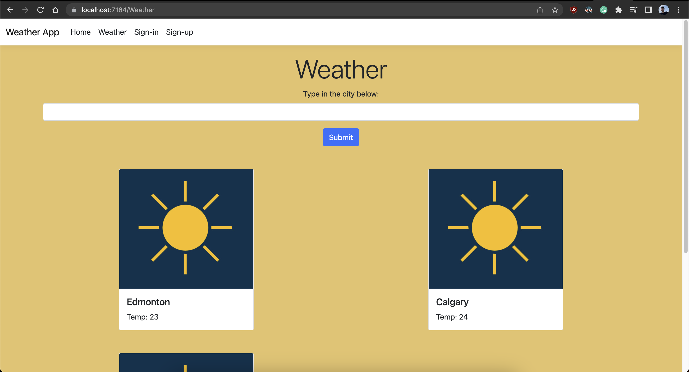

# Weather App

A weather app built with ASP.NET Core MVC with user authentication, routing, and database interaction.
Keep track of users' added locations.


In order to run the application:

1. Clone the repo
  ```sh
  git clone https://github.com/rezamshy/Weather_App.git
  ```

2. go to MVCWeather/ folder
  ```
  cd Weather_App/MVCWeather
  ```

3. Run the server using
  ```
  dotnet run
  ```

4. Access the app through a browser with the below address
  ```sh
  http://localhost:5190
  ```



Ongoing features:
User authentication,
Add weather API,
Store user-selected cities in the database for each user.
